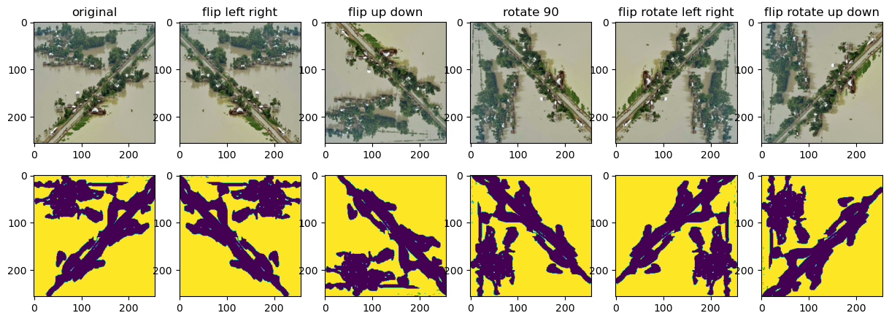
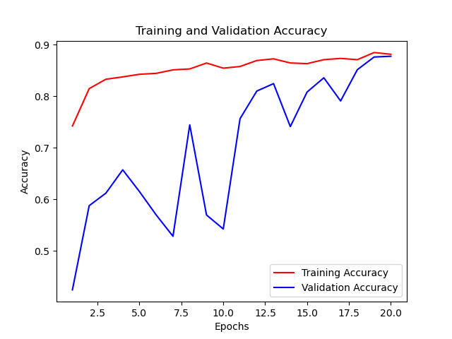
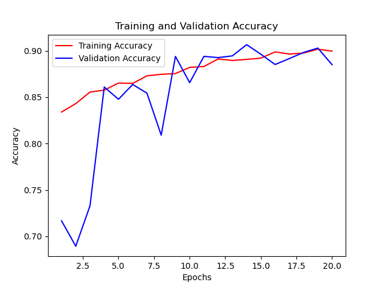
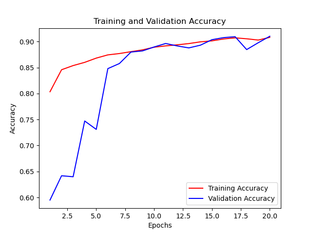
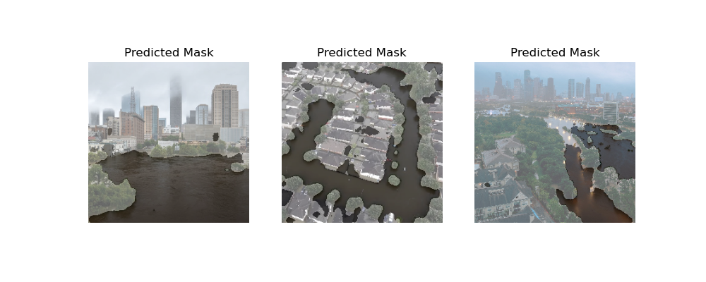

# Flood Segmentation Using UNet

## Inspirations

Houston frequently encounters flooding, which leads to significant damages, especially during the hurricane season. The primary goal of this project is to utilize machine learning and computer vision to accurately detect affected areas in images, offering valuable insights for disaster response and mitigation endeavors.

#### Houston's flood in 2018


## Datasets

Obtained from Kaggle

#### Acknowlegement
```
https://www.kaggle.com/datasets/faizalkarim/flood-area-segmentation
```

#### Preprocessing 

The dataset includes 290 images and their correspoding mask, which can be considered small. To expand the dataset, we will utilize augmentation techniques. The size of training set increase from 185 to 1183 images after augmentation.




## Model Performance Comparisons


#### Trained on original dataset


The model exhibits signs of overfitting as indicated by the validation accuracy, which only aligns with the training accuracy after epoch 19. This outcome is anticipated given the limited size of the dataset. To address this issue and enhance accuracy, we should consider exploring alternative methods such as increasing the dataset size.



#### Trained on augmented dataset with the same batch size (= 8) as used in the previous model

The model trained on the augmented dataset demonstrated improved performance. The validation accuracy was able to catch up with the training accuracy in just a few epochs. This outcome suggests that the augmentation of the dataset has positively impacted the model's ability to generalize and reduce overfitting.



#### Trained on augmented dataset with an increased batch size (= 16) 

In this model, both the training and validation accuracy scores converge to similar values after a few epochs. This indicates that the model is performing consistently well on both the training and validation datasets. The alignment of these scores suggests that the model is generalizing effectively and not suffering from overfitting.


## Test on Houston flood images




