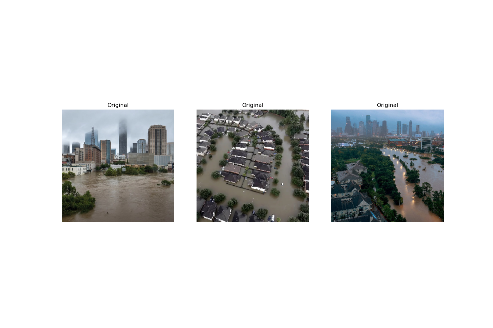

# Flood Segmentation Using UNet

## Inspirations

During hurricane season, Houston is prone to flooding, leading to extensive damages as witnessed in recent years, particularly during Hurricane Harvey. This project aims to evaluate the severity of flood damage by implementing machine learning-based semantic segmentation techniques.
#### Houston's flood in 2018

